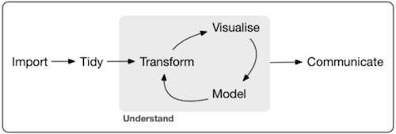

DTUR101 - Introduction to Applied Data Analysis with R
================

-   [Course Introduction](#course-introduction)
    -   [Aim](#aim)
    -   [Teacher](#teacher)
    -   [Scope and Form](#scope-and-form)
    -   [Recommended Prerequisites](#recommended-prerequisites)
    -   [Content](#content)
    -   [Schedule](#schedule)
    -   [Software](#software)
    -   [Some Useful Links](#some-useful-links)
    -   [Questions](#questions)
-   [Course Timetable](#course-timetable)
    -   [Week 1 - Monday January 29th 2018 13-17](#week-1---monday-january-29th-2018-13-17)
    -   [Week 2 - Monday February 5th 2018 13-17](#week-2---monday-february-5th-2018-13-17)
    -   [Week 3 - Monday February 12th 2018 13-17](#week-3---monday-february-12th-2018-13-17)
    -   [Week 4 - Monday February 19th 2018 13-17](#week-4---monday-february-19th-2018-13-17)
    -   [Week 5 - Monday February 26th 2018 13-17](#week-5---monday-february-26th-2018-13-17)
    -   [Week 6 - Monday March 5th 2018 13-17](#week-6---monday-march-5th-2018-13-17)
    -   [Week 7 - Monday March 12th 2018 13-17](#week-7---monday-march-12th-2018-13-17)
    -   [Week 8 - Monday March 19th 2018 13-17](#week-8---monday-march-19th-2018-13-17)
    -   [Easter Vacation - Monday March 26th 2018 13-17](#easter-vacation---monday-march-26th-2018-13-17)
    -   [Easter Vacation - Monday April 2nd 2018 13-17](#easter-vacation---monday-april-2nd-2018-13-17)
    -   [Week 9 - Monday April 9th 2018 13-17](#week-9---monday-april-9th-2018-13-17)
    -   [Week 10 - Monday April 16th 2018 13-17](#week-10---monday-april-16th-2018-13-17)
    -   [Week 11 - Monday April 23rd 2018 13-17](#week-11---monday-april-23rd-2018-13-17)
    -   [Week 12 - Monday April 30th 2018 13-17](#week-12---monday-april-30th-2018-13-17)
    -   [Week 13 - Monday May 7th 2018 13-17](#week-13---monday-may-7th-2018-13-17)
    -   [Videos](#videos)

Course Introduction
===================

Aim
---

The aim of 'Introduction to Applied Data Analysis with R' is to introduce the [The R Project for Statistical Computing](https://www.r-project.org/) and the [Tidyverse framework](https://www.tidyverse.org/) to tidy, transform, visualise, analyse, model and communicate our data in the context of wet-lab bio-engineering. The course will run as a PhD+ course and participants are eligeble to collect 2.5 ECTS points.

Teacher
-------

The course will be taught by [Leon Eyrich Jessen](http://www.dtu.dk/service/telefonbog/person?id=22554&cpid=230023&tab=2&qt=dtupublicationquery) from the [Immunoinformatics and Machine Learning](http://www.bioinformatics.dtu.dk/english/Research_new/Health-informatics/Immunoinformatics-and-machine-learning) group at Department of Bio and Health Informatics at the Technical University of Denmark.

Scope and Form
--------------

The course consist of a series of [video lectures](https://www.youtube.com/playlist?list=PL4L59zaizb3FmBdxuDLRdzGsknTrZN6Ys) by [Morten Arendt Rasmussen](http://food.ku.dk/english/staff/?pure=en/persons/311655/), followed by hands-on exercises. Before each lecture students are expected to have seen the 1-2 videos. We will then start with discussing the videos and follow up with how to apply the concepts in R. This means that if the video includes a demonstration in R, you are of course welcome to see it - BUT it will not nessesarily be the demonstration we will work with at the exercises.

Recommended Prerequisites
-------------------------

It is expected that students have a basic knowledge of math and calculus and linear algebra equivalent to introductory university courses. No prior knowledge of programming is required.

Content
-------

Non-exhaustive: We will cover descriptive statistics, data distribution, t-test (and a couple of others), PCA, data manipulation, exploration, visualisation and documentation in R.

Schedule
--------

The course will run in the spring semester (13-week period) of 2018, which according to the [DTU academic calendar](http://www.dtu.dk/english/education/student-guide/studying-at-dtu/Academic-calendar) is from 29/1 2018 to 8/5 2018, exluding holiday and non-teaching study breaks.

Software
--------

Students are required to bring their own laptop and preferably install the following software before the first class

-   [R](https://mirrors.dotsrc.org/cran/)
-   [RStudio](https://www.rstudio.com/products/rstudio/download/#download)

Some Useful Links
-----------------

-   [swirl - Learn R, in R](http://swirlstats.com/)
-   [Ten Simple Rules for Effective Statistical Practice](http://journals.plos.org/ploscompbiol/article?id=10.1371/journal.pcbi.1004961)
-   [A Quick Guide to Organizing Computational Biology Projects](http://journals.plos.org/ploscompbiol/article?id=10.1371/journal.pcbi.1000424)
-   [R for Data Science](http://r4ds.had.co.nz/)
-   [A Guide to Reproducible Code]()

Questions
---------

Please contact course responsible [Leon Eyrich Jessen](http://www.dtu.dk/service/telefonbog/person?id=22554&cpid=230023&tab=2&qt=dtupublicationquery)

Course Timetable
================

Week 1 - Monday January 29th 2018 13-17
---------------------------------------

**Location**

-   The library at DTU Bioinformatics (building 208, room 027) at 1pm.

The first day we will focus on getting the software we need up and running. Then we will dive into programming in R. There will be a learning curve, I am fully aware of this, but I am confident that if you put the effort into climbing it, the reward will be well worth it. Programming is not only learning what to write when, but it is also learning a certain way of thinking - A new mindset if you will.

Please try to install R and RStudio before the first class

-   [R](https://mirrors.dotsrc.org/cran/)
-   [RStudio](https://www.rstudio.com/products/rstudio/download/#download)

**Class Curriculum**

-   Installing R, RStudio and TidyVerse
-   Gentle introduction to programming in general and in R
-   If we have time, video: [1 - Descriptive Statistics](https://www.youtube.com/watch?v=SOYt84ZPTx0)

**Post Class**

-   [Here is the code we went through today](R/day_01.R)

Week 2 - Monday February 5th 2018 13-17
---------------------------------------

**Location**

-   Ly202-R8107-LIFE 1pm - 5pm

Based on what we learned in week 1, we will move onto some data visualisation using the `ggplot` package, which is part of the [`tidyverse`](https://www.tidyverse.org/) framework. The `tidyverse` framework is a particular take on how to do data analysis. It implements a philosophy where the work goes into getting your data into a well-defined format and once this is obtained, the different `tidyverse` functions can be applied to import-tidy-transform-visualise-model-communicate your data as illustrated in this figure (taken from [R for Data Science](http://r4ds.had.co.nz/))

This means, that we will leave base R for now and henceforth we will continue our endevour using `Tidyverse`.

Please try to install `Tidyverse` before the class

-   In the console in RStudio, run this command: `install.packages('tidyverse')`

**Class Curriculum**

-   Recapitulation of previous class
-   Introduction to `Tidyverse`
-   Data visualisation using `ggplot`
-   Video: [2 - Plotting with ggplot2](https://www.youtube.com/watch?v=oXlXVyiedBw)

**Post Class**

-   [Here is the code we went through today](R/day_02.R)
-   [And a presentation on tidyverse](http://htmlpreview.github.io/?https://github.com/leonjessen/DTUR101/blob/master/doc/tidy_talk.html)

Week 3 - Monday February 12th 2018 13-17
----------------------------------------

**Location**

-   Ly202-R8107-LIFE 1pm - 5pm

Now we have learned the basics of `R`, touched upon descriptive statistics and been introduced to `tidyverse` and `ggplot`. We continue with data visualisation and then turn to data distributions. We will take a closer at the normal distribution and also look at confidence intervals, when estimating population mean based on a sample.

**Class Curriculum**

-   Recapitulation of previous class
-   Data visualisation using `ggplot` continued
-   Introduction to data distributions
-   The normal distribution
-   Confidence intervals
-   Video: [7 - Normal distribution](https://www.youtube.com/watch?v=C_INrc633uk)
-   Video: [8 - Normal distribution Confidence Interval](https://www.youtube.com/watch?v=02S8L5H6l0U)

**Post Class**

-   [Here is the code we went through today](R/day_03.R)
-   [Confidence Intervals Visualised](https://github.com/leonjessen/confidence_intervals_visualised)

Week 4 - Monday February 19th 2018 13-17
----------------------------------------

**Location**

-   Ly202-R8107-LIFE 1pm - 5pm

We have now become more familiar with `R` and we have tried to solve some simple tasks on our own. We have touched upon the normal distribution and used it to calculate some probabilities. We also discussed some properties of probability density functions. Now it is time to address how we state and test a hypothesis. Furthermore we will discuss how we interpret the result of a test and also possible errors. We will use the `t-test` as a point of reference for this.

**Class Curriculum**

-   Recapitulation of previous class
-   Briefly on cleaning data
-   The standard normal distribution
-   Statistical hypothesis
-   The `t-test`
-   Test statistics, p-values, level of significance, type I and II errors
-   Video: [9 - T-test](https://www.youtube.com/watch?v=D996ja8ZBN4)
-   Video: [10 - T-test inR](https://www.youtube.com/watch?v=KDpsF5dgIVI)

**Post Class**

-   [Here is the code we went through today](R/day_04.R)

Week 5 - Monday February 26th 2018 13-17
----------------------------------------

**Location** **Class Curriculum** **Post Class**

Week 6 - Monday March 5th 2018 13-17
------------------------------------

**Location** **Class Curriculum** **Post Class**

Week 7 - Monday March 12th 2018 13-17
-------------------------------------

**Location** **Class Curriculum** **Post Class**

Week 8 - Monday March 19th 2018 13-17
-------------------------------------

**Location** **Class Curriculum** **Post Class**

Easter Vacation - Monday March 26th 2018 13-17
----------------------------------------------

Easter Vacation - Monday April 2nd 2018 13-17
---------------------------------------------

**Location** **Class Curriculum** **Post Class**

Week 9 - Monday April 9th 2018 13-17
------------------------------------

**Location** **Class Curriculum** **Post Class**

Week 10 - Monday April 16th 2018 13-17
--------------------------------------

**Location** **Class Curriculum** **Post Class**

Week 11 - Monday April 23rd 2018 13-17
--------------------------------------

**Location** **Class Curriculum** **Post Class**

Week 12 - Monday April 30th 2018 13-17
--------------------------------------

**Location** **Class Curriculum** **Post Class**

Week 13 - Monday May 7th 2018 13-17
-----------------------------------

**Location** **Class Curriculum** **Post Class**

Videos
------

-   Video: [3 - PCA concept](https://www.youtube.com/watch?v=NFIkD9-MuTY)
-   Video: [4 - PCA estimation, centering/scaling, variance explained and biplot](https://www.youtube.com/watch?v=TraMXdEqeys)
-   Video: [5 - Correlation and Covariance - Nuts and bolt](https://www.youtube.com/watch?v=WcPGgtptxZ4)
-   Video: [6 - Correlation and PCA](https://www.youtube.com/watch?v=EHb_kuw1GNU)
-   Video: [12 - Categorical Data - Chisq test - how to](https://www.youtube.com/watch?v=fEXa8dQwlDw)
-   Video: [13 - Binomial distribution](https://www.youtube.com/watch?v=F2NpmXEwFVE)
-   Video: [14 - Binomial Distribution Test](https://www.youtube.com/watch?v=L5jehIE_Sn0)
-   Video: [15 - Binomial distribution - estimation](https://www.youtube.com/watch?v=wZ9c7xG-et4)
-   Video: [16 - Power calculation for the binomial distribution](https://www.youtube.com/watch?v=O_D8csjLr4s)
-   Video: [17 - Power calculation for Ttest-data](https://www.youtube.com/watch?v=uDvfgpvrhqM)
-   Video: [18 - Power calculation for Ttest type data inR](https://www.youtube.com/watch?v=FeQKkkpd-Ew)
-   Video: [19 - Oneway ANOVA](https://www.youtube.com/watch?v=1n74nlIqBTE)
-   Video: [20 - Contrasts in ANOVA models](https://www.youtube.com/watch?v=JpUSVNTNTQk)
